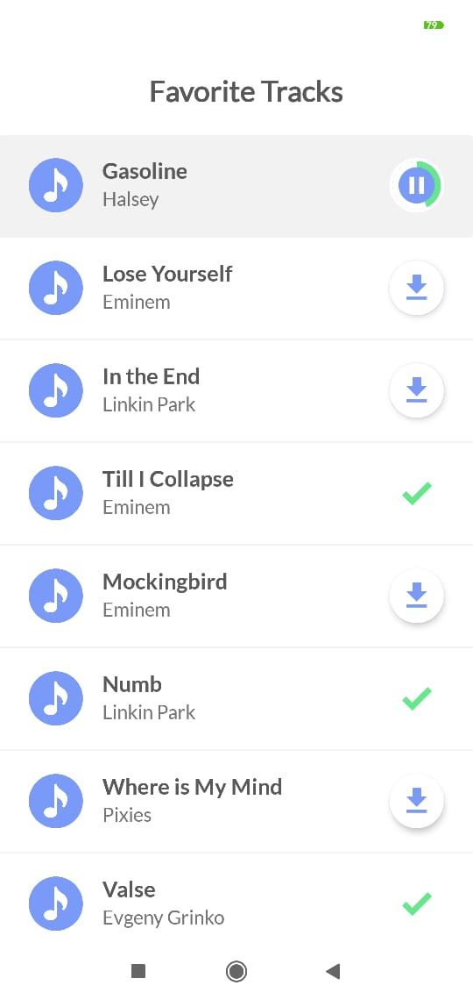

# Music Downloader

 This is an Android Application for downloading musics. Musics are just dummy list but for downloading a music 
 a logic is written in this app. It can be easily added some api for downloading. This app is written in MVVM design pattern
 using Room,LiveData,ViewModel

  
" 

### Installing
apk link:  https://github.com/mirzemehdi/MusicDownloader/raw/master/apk/musicdownloader.apk  

## Used Libraries and Classes

**Room** - for storing musics in phone's database  
**LiveData** 
**ViewModel**  
**ButterKnife** - for binding views easily
**RecylerView** - for showing musics in the list    
**CardView** - in music row for better design  
**CircleProgress** - is used while musics are loading  

## Authors

----Developed by ***Mirzamehdi Karimov***----

